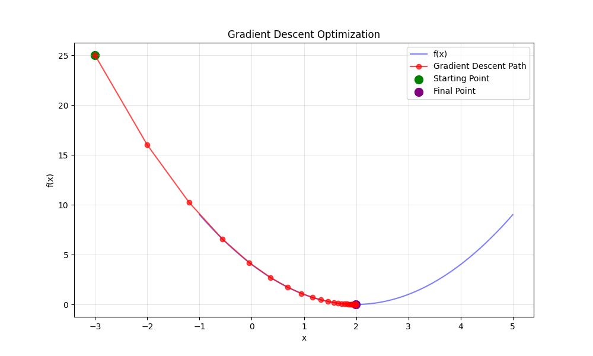

# DeepLearningEngineRoom
Python code &amp; visualisations exploring the fundamental mechanics within deep learning's engine room



## Setup

```bash
# Using venv
python -m venv venv

# Activate on macOS/Linux
source venv/bin/activate

pip install -r requirements.txt

```

### Run the python code 

```bash
python3 src/tensor_basics.py
```
